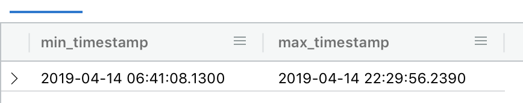
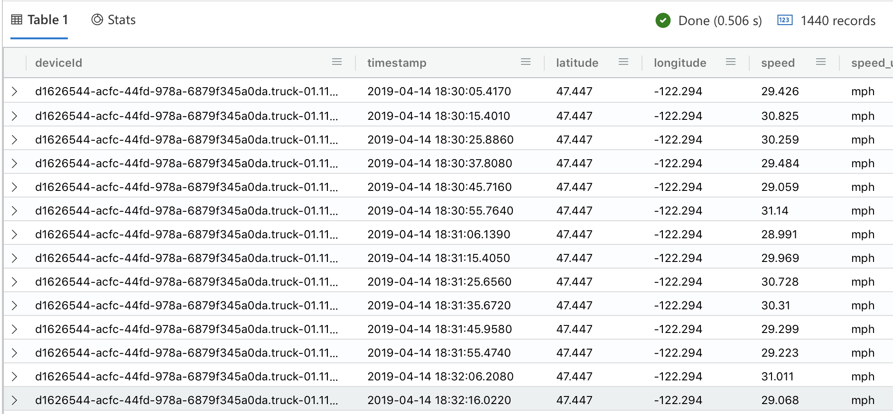

# Kusto Queries

## Count
```
Trucks
| count 
```

```
Result: 114,048,366
Execution time: 751ms
```

## Group by DeviceId
```
Trucks
| summarize count() by deviceId 
```

```
Result: 20'000 rows (data set consists of 20'000 devices generating messages concurrently)
Execution time: 4.803s
```

## Count all messages for one deviceId
```
Trucks
| where deviceId == 'd1626544-acfc-44fd-978a-6879f345a0da.truck-01.11578'
| summarize count() 
```

```
Result: 5'698
Execution time: 412ms
```

## For a specific deviceId, return the first and last values in the db
```
Trucks
| where deviceId == 'd1626544-acfc-44fd-978a-6879f345a0da.truck-01.11578'
| summarize min(timestamp), max(timestamp
```

Result (1.773secs):


## For a specific deviceId, return all observations for a 4-hour period
```
let endtime = todatetime('2019-04-14T22:29:56.28Z');
let starttime = datetime_add('hour', -4, endtime);
Trucks
| where deviceId == 'd1626544-acfc-44fd-978a-6879f345a0da.truck-01.11578'
| where timestamp between (starttime .. endtime)
```

Result (506ms)


## For a specific deviceId, return all observations in time bins of 30 minutes for the last 4 ## hours
## bin the data by avg value, min and max

```
let endtime = todatetime('2019-04-14T22:29:56.28Z');
let starttime = endtime - time(4h);
let interval = 30min;
Trucks
| where deviceId == 'd1626544-acfc-44fd-978a-6879f345a0da.truck-01.11578'
| make-series avg(temperature), min(temperature), max(temperature) on timestamp from starttime to endtime step interval
```

Result(272ms)
```
"avg_temperature": [
	37.352576661275315,
	36.40684256367334,
	36.99978174551556,
	35.68918785255586,
	34.56910191658437,
	35.390803014333194,
	35.58113961548412,
	32.90598796132888
],
"min_temperature": [
	35.190268843769,
	34.2216360426079,
	35.145748779321,
	34.2953068784487,
	33.0179695700665,
	33.1734080737009,
	33.9094037967924,
	29.9685465561444
],
"max_temperature": [
	40.3772943236759,
	38.2904295766479,
	38.3881043785138,
	37.8335105361238,
	36.0649513230323,
	37.9757089866405,
	37.5442186461278,
	37.4409570118184
],
"timestamp": [
	"2019-04-14T18:29:56.2800000Z",
	"2019-04-14T18:59:56.2800000Z",
	"2019-04-14T19:29:56.2800000Z",
	"2019-04-14T19:59:56.2800000Z",
	"2019-04-14T20:29:56.2800000Z",
	"2019-04-14T20:59:56.2800000Z",
	"2019-04-14T21:29:56.2800000Z",
	"2019-04-14T21:59:56.2800000Z"
],
```


