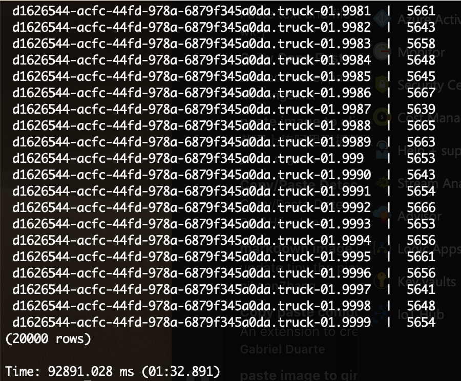
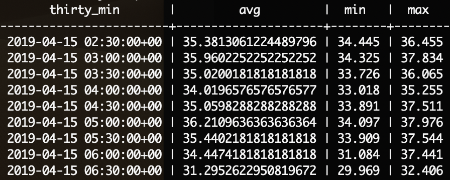

# Timescale queries

## Count

```
select count(*) from trucks;
```

```
Result: 113000115
Execution time: 1min 46sec
```

Second execution (I suppose indexes are still being built after ingesting over 100 million rows of data)
```
Result: 113737258
Execution time: 1min 10secs
```

## Group by deviceId
```
select connectiondeviceid, count(*) from trucks                                                              group by connectiondeviceid;
```

```
Result: 20'000 rows
Execution time: 1min 30secs
```


## Count all messages for one deviceId
```
SELECT COUNT(*) FROM trucks
WHERE connectiondeviceid = 'd1626544-acfc-44fd-978a-6879f345a0da.truck-01.11578';
```

```
Result: 5'645
Execution time: 1min 12secs
```

## For a specific deviceId, return the first and last values in the db
```
SELECT eventprocessedutctime FROM trucks 
WHERE connectiondeviceid = 'd1626544-acfc-44fd-978a-6879f345a0da.truck-01.11578'
ORDER BY eventprocessedutctime DESC LIMIT 1;
```

Result (111.275ms):
2019-04-15 06:46:24.551888+00

```
select eventprocessedutctime                                                                  from trucks                                                                                   where connectiondeviceid = 'd1626544-acfc-44fd-978a-6879f345a0da.truck-01.11578'              order by eventprocessedutctime asc limit 1;
```

Result (175.378ms)
2019-04-14 06:41:08.246557+00

## For a specific deviceId, return all observations for a 4-hour period
```
SELECT *
FROM trucks
WHERE connectiondeviceid = 'd1626544-acfc-44fd-978a-6879f345a0da.truck-01.11578'              
AND eventprocessedutctime <= TIMESTAMPTZ '2019-04-15 06:46:24.551888+00'
AND eventprocessedutctime > TIMESTAMPTZ '2019-04-15 06:46:24.551888+00' - interval '4 hours';
```

Result (2.295secs)


## For a specific deviceId, return all observations in time bins of 30 minutes for the last 4 ## hours
## bin the data by avg value, min and max

```
SELECT count(*)
FROM trucks
where connectiondeviceid = 'd1626544-acfc-44fd-978a-6879f345a0da.truck-01.11578'              
    and eventprocessedutctime <= TIMESTAMPTZ '2019-04-15 06:46:24.551888+00'
    and eventprocessedutctime > TIMESTAMPTZ '2019-04-15 06:46:24.551888+00' - interval '4 hours'
```

```
SELECT time_bucket('30 minutes', eventprocessedutctime) AS thirty_min, avg(temperature), min(temperature), max(temperature)
FROM trucks
where connectiondeviceid = 'd1626544-acfc-44fd-978a-6879f345a0da.truck-01.11578'              
    and eventprocessedutctime <= TIMESTAMPTZ '2019-04-15 06:46:24.551888+00'
    and eventprocessedutctime > TIMESTAMPTZ '2019-04-15 06:46:24.551888+00' - interval '4 hours'
GROUP BY thirty_min
ORDER BY thirty_min DESC
```

Result(2.419secs)



